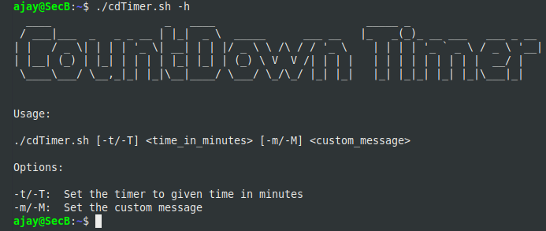
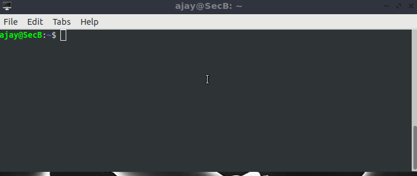
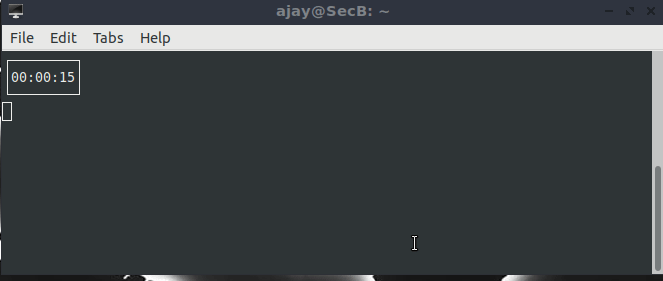

# CountDownTimer   

CountdownTimer written in shell script. You can use it as a pomodoro timer to track your work hour, and take break time to time. Or you can use it for anything.   

**Dependencies :**  install espeak and toilet in your linux box.   

```shell  
sudo apt update
sudo apt install espeak
sudo apt install toilet 
```  

**Main Features :**  

* Simple and easy to use   
* text-to-speech (espeak) with given message

**Help Menu :**  

  

**Usage :**  

Run on default 

```shell  
./cdTimer.sh
```  

Run with given time 

```shell   
./cdTimer.sh -t 30
```  

Run with given message   

```shell  
./cdTimer.sh -t 90 -m "Time to take break"
```  

  

  


